# Cloud Threat Detection Lab

## Overview
This project demonstrates a cloud security monitoring setup on AWS using native services to detect and analyze suspicious activities.

The lab simulates real-world attack scenarios such as:
- Failed SSH login attempts
- Port scanning (reconnaissance)
- Suspicious IAM activity

It uses:
- AWS CloudTrail for API activity logging
- Amazon CloudWatch for monitoring metrics
- Amazon EC2 as a test environment
- Amazon S3 for log storage
- Amazon SNS for alerts

## Objectives
- Monitor AWS API activity and EC2 metrics
- Simulate common attack behaviors
- Analyze logs to identify suspicious patterns
- Document findings like a real-world security analyst

## Architecture
- EC2 instance (test target)
- CloudTrail logging to S3
- CloudWatch metrics + alarms
- SNS for alerting

## Security Features
- Restricted SSH access (only my IP)
- Minimal open ports (only port 22)
- Activity logging with CloudTrail
- Monitoring with CloudWatch metrics and alarms

## Attack Simulations
- Failed SSH login attempts
- Port scanning (reconnaissance)
- Suspicious IAM/API activity

## Key Findings
- SSH attempts are not logged in CloudTrail (OS-level activity)
- CloudTrail effectively logs IAM and API activity
- CloudWatch detects system-level anomalies like CPU spikes

## Screenshots

## EC2 Instance
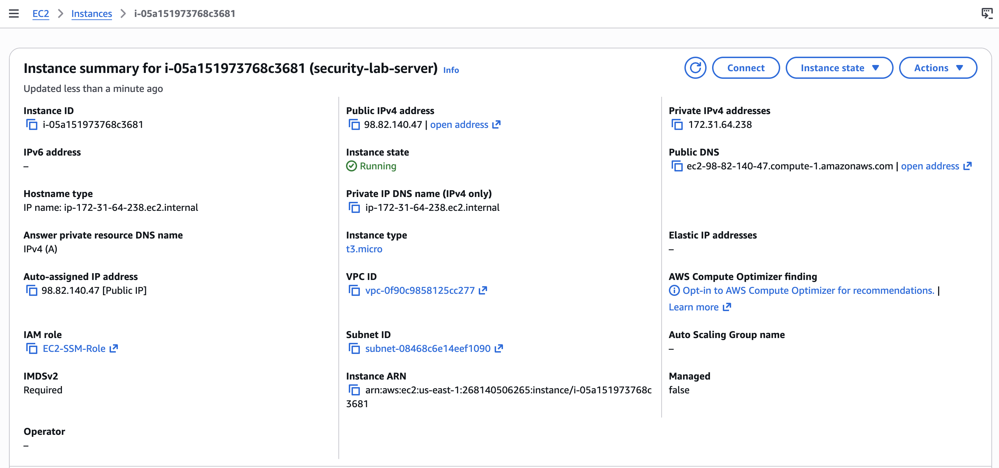

## EC2 Monitoring
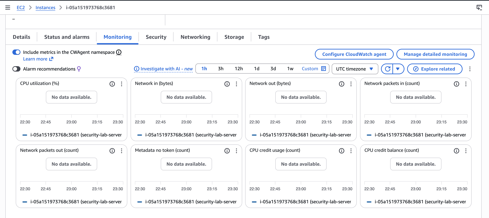

## CloudWatch Metrics
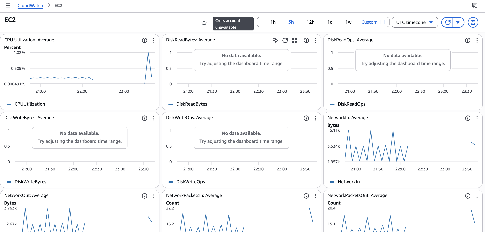

## CloudWatch Alarm
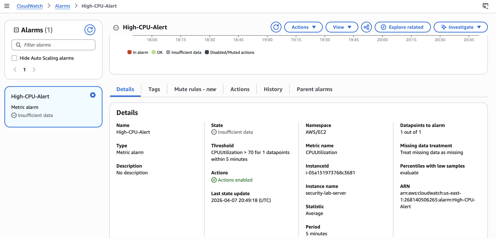

## SNS Notifications
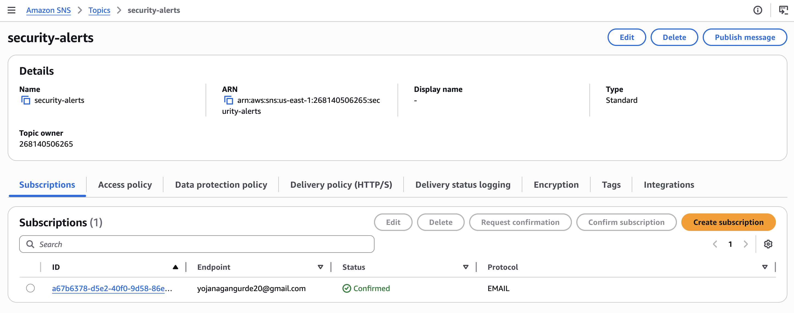

## CloudTrail Trail Setup
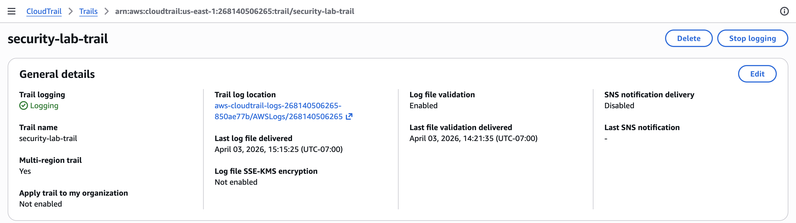

## CloudTrail Event History
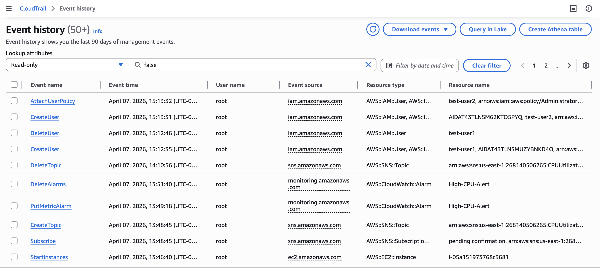

## SSH Failed Logins
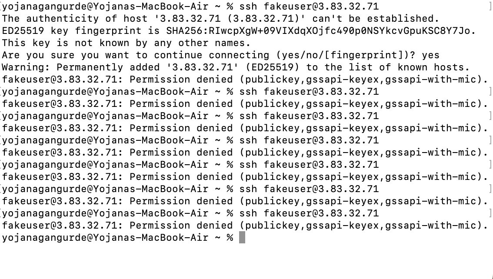

## Port Scan
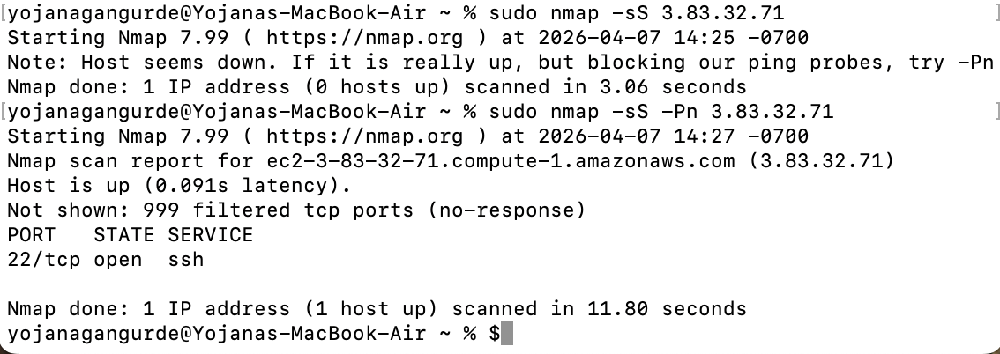

## Suspicious API Activity
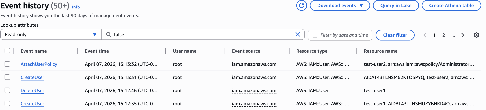

## S3 Logs
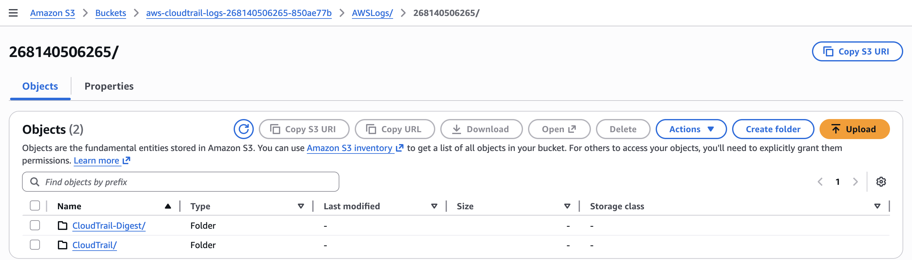

## Architecture Diagram
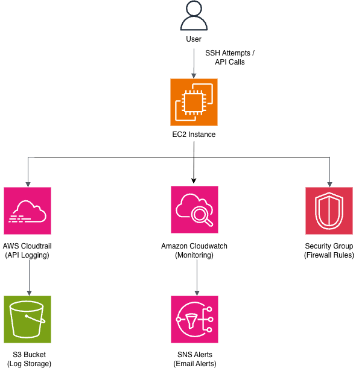

## Note on GuardDuty
GuardDuty integration was planned, but due to account subscription restrictions, this project demonstrates manual threat detection using CloudTrail and CloudWatch.

## Skills Demonstrated
- Cloud security monitoring
- AWS logging and auditing
- Threat simulation and analysis
- Incident reporting

## Outcome
This lab simulates how a security analyst detects threats using native AWS tools without relying on automated services like GuardDuty.
